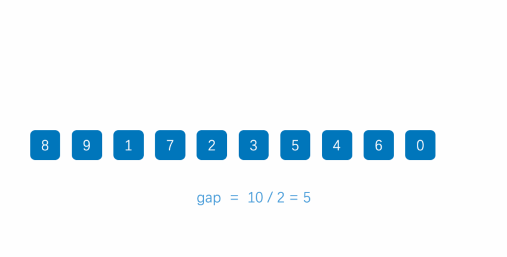
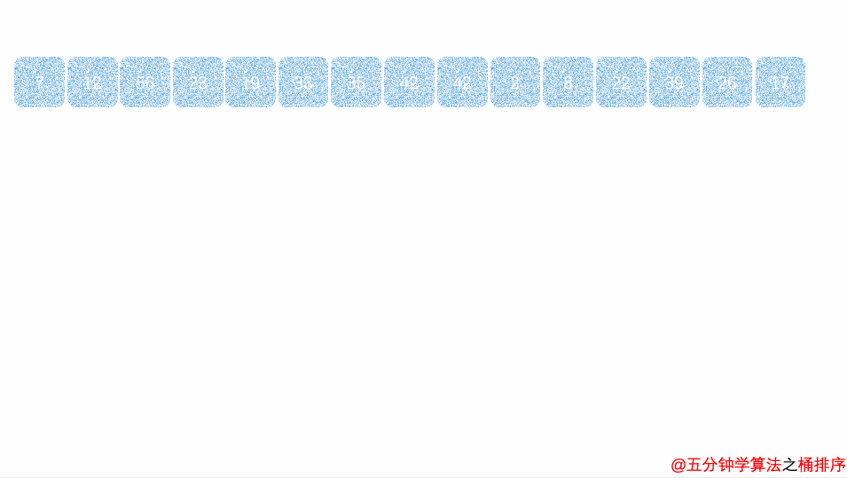

# 排序算法

## 算法简介

排序算法是《数据结构与算法》中最基本的算法之一。

排序算法可以分为**内部排序**和**外部排序**

**内部排序**：数据记录在内存中进行排序

**外部排序**：因排序的数据很大，一次不能容纳全部的排序记录，在排序过程中需要访问外存。

用一个表概括常见的排序：

| 排序算法 | 平均时间复杂度 | 最好情况  | 最坏情况  | 空间复杂度 | 排序方式  | 稳定性 |
| :------: | :------------: | :-------: | :-------: | :--------: | :-------: | :----: |
| 冒泡排序 |     O(n^2)     |   O(n)    |  O(n^2)   |    O(1)    | In-place  |  稳定  |
| 选择排序 |     O(n^2)     |  O(n^2)   |  O(n^2)   |    O(1)    | In-place  | 不稳定 |
| 插入排序 |     O(n^2)     |   O(n)    |  O(n^2)   |    O(1)    | In-place  |  稳定  |
| 希尔排序 |    O(nlogn)    | O(nlog²n) | O(nlog²n) |    O(1)    | In-place  | 不稳定 |
| 归并排序 |    O(nlogn)    | O(nlogn)  | O(nlogn)  |    O(n)    | Out-place |  稳定  |
| 快速排序 |    O(nlogn)    | O(nlogn)  |  O(n^2)   |  O(logn)   | In-place  | 不稳定 |
|  堆排序  |    O(nlogn)    | O(nlogn)  | O(nlogn)  |    O(1)    | In-place  | 不稳定 |
| 计数排序 |     O(n+k)     |  O(n+k)   |  O(n+k)   |    O(k)    | Out-place |  稳定  |
|  桶排序  |     O(n+k)     |  O(n+k)   |  O(n^2)   |   O(n+k)   | Out-place |  稳定  |
| 基数排序 |     O(n*k)     |  O(n*k)   |  O(n*k)   |   O(n+k)   | Out-place |  稳定  |

示意图如下：


名词解释：

- n：数据规模
- k："桶"的个数
- In-place：占用常数内存，不占用额外内存
- Out-place：占用额外内存
- 稳定性：排序后 2 个相等键值的顺序和排序之前它们的顺序相同

排序算法还可以分为**比较类排序**和**非比较类排序**：

**比较类排序**：通过比较来决定元素间的相对次序，由于其时间复杂度不能突破O(nlogn)，因此也称为非线性时间比较类排序。

**非比较类排序**：不通过比较来决定元素间的相对次序，它可以突破基于比较排序的时间下界，以线性时间运行，因此也称为线性时间非比较类排序。 

用一个图概括常见的排序：


## 冒泡排序

### 简介

- 冒泡排序（Bubble Sort）也是一种简单直观的排序算法。它重复地走访过要排序的数列，一次比较两个元素，如果他们的顺序错误就把他们交换过来。走访数列的工作是重复地进行直到没有再需要交换，也就是说该数列已经排序完成。这个算法的名字由来是因为越小的元素会经由交换慢慢"浮"到数列的顶端。

- 作为最简单的排序算法之一，冒泡排序给我的感觉就像 Abandon 在单词书里出现的感觉一样，每次都在第一页第一位，所以最熟悉。冒泡排序还有一种优化算法，就是立一个 flag，当在一趟序列遍历中元素没有发生交换，则证明该序列已经有序。但这种改进对于提升性能来说并没有什么太大作用。

### 算法步骤

1. 比较相邻的元素。如果第一个比第二个大，就交换他们两个。

2. 对每一对相邻元素作同样的工作，从开始第一对到结尾的最后一对。这步做完后，最后的元素会是最大的数。

3. 针对所有的元素重复以上的步骤，除了最后一个。

4. 持续每次对越来越少的元素重复上面的步骤，直到没有任何一对数字需要比较。

### 动图演示


### 案例代码

bubbleSort.java

```java
public class bubbleSort {
    public static void doBubbleSort(int[] a) {
        for (int i = 0; i < a.length - 1; i++) {//进行n-1次循环
            for (int j = 0; j < a.length - i - 1; j++) {
                if (a[j] > a[j + 1]) {//若当前的值大于后一个值时做交换
                    int t = a[j + 1];
                    a[j + 1] = a[j];
                    a[j] = t;
                }
            }
        }
    }
}
```

bubbleSort.java（优化）

- 立一个 flag，当在一趟序列遍历中元素没有发生交换，则证明该序列已经有序。但这种改进对于提升性能来

~~~java
public static void sort(int[] arr){
	for (int i = 1; i < arr.length; i++) {
		// 设定一个标记，若为true，则表示此次循环没有进行交换，也就是待排序列已经有序，排序已经完成。
        boolean flag = true;
        for (int j = 0; j < arr.length - i; j++) {
            if (arr[j] > arr[j + 1]) {
                int tmp = arr[j];
                arr[j] = arr[j + 1];
                arr[j + 1] = tmp;
                flag = false;
            }
        }
        if (flag)
        break;
	}
}
~~~

Main.java

```java
import java.util.Arrays;

public class Main {
    public static void main(String[] args){
        int[] a = {1, 2, 32, 1, 2, 3, 2, 1,};
        bubbleSort.doBubbleSort(a);
        System.out.println(Arrays.toString(a));
    }
}
```


## 选择排序

### 简介

- 选择排序是一种简单直观的排序算法，无论什么数据进去都是 O(n²) 的时间复杂度。所以用到它的时候，数据规模越小越好。唯一的好处可能就是不占用额外的内存空间了吧。

### 算法步骤

1. 首先在未排序序列中找到最小（大）元素，存放到排序序列的起始位置。
2. 再从剩余未排序元素中继续寻找最小（大）元素，然后放到已排序序列的末尾。
3. 重复第二步，直到所有元素均排序完毕。

### 动图演示


### 案例代码

insertSort.java

```java
public class selectSort {
    public static void doSelectSort(int[] array) {
        for (int i = 0; i < array.length - 1; i++) {
            int t = i;//记录下标
            for (int j = i + 1; j < array.length; j++) {
                if (array[t] > array[j]) {//比较数值
                    t=j;//赋予较小值的下标
                }
            }
            //交换两个值
            int temp = array[t];
            array[t]=array[i];
            array[i]=temp;
        }
    }
}
```

Main.java

```java
import java.util.Arrays;

public class Main {
    public static void main(String[] args){
        int[] a = {1, 2, 32, 1, 2, 3, 2, 1,};
        selectSort.doSelectSort(a);
        System.out.println(Arrays.toString(a));
    }
}
```


## 插入排序

### 简介

- 插入排序的代码实现虽然没有冒泡排序和选择排序那么简单粗暴，但它的原理应该是最容易理解的了，因为只要打过扑克牌的人都应该能够秒懂。插入排序是一种最简单直观的排序算法，它的工作原理是通过构建有序序列，对于未排序数据，在已排序序列中从后向前扫描，找到相应位置并插入。
- 插入排序和冒泡排序一样，也有一种优化算法，叫做**拆半插入**。

### 算法步骤

1. 将第一待排序序列第一个元素看做一个有序序列，把第二个元素到最后一个元素当成是未排序序列。
2. 从头到尾依次扫描未排序序列，将扫描到的每个元素插入有序序列的适当位置。（如果待插入的元素与有序序列中的某个元素相等，则将待插入元素插入到相等元素的后面。）

### 动图演示


### 案例代码

insertSort.java

```java
public class insertSort {
    public static void doInsertSort(int[] array){
        for(int i = 1; i <array.length; i++){//外层向右的index，即作为比较对象的数据的index
            int temp = array[i];//用作比较的数据
            int j = i -1;
            while(j>=0 && array[j]>temp){//当比到最左边或者遇到比temp小的数据时，结束循环
                array[j+1] = array[j];
                j--;
            }
            array[j+1] = temp;//把temp放到空位上
        }
    }
}
```

BinaryInsertSort.java（优化）

- 在插入到已排序的数据时采用来**折半查找（二分查找）**，取已经排好序的数组的中间元素，与插入的数据进行比较，如果比插入的数据大，那么插入的数据肯定属于前半部分，否则属于后半部分，依次不断缩小范围，确定要插入的位置。

```java
public class BinaryInsertSort {
    private static void binaryInsertSort(int arr[]){
        int low,high,m,temp,i,j;
        for(i = 1;i<arr.length;i++){
            //折半查找应该插入的位置
            low = 0;
            high = i-1;
            while(low <= high){
                m = (low+high)/2;
                if(arr[m] > arr[i])
                    high = m - 1;
                else
                    low = m + 1;
            }
            //统一移动元素，然后将这个元素插入到正确的位置
            temp = arr[i];
            for(j=i;j>high+1;j--){
                arr[j] = arr[j-1];
            }
            arr[high+1] = temp;
        }        
    }
}
```

Main.java

```java
public class Main {
    public static void main(String[] args){
        int arr[] = { 5 , 2 , 6 , 0 , 9 };   
        //打印排序前的数据
        System.out.println("排序前的数据：");
        for (int i = 0; i < arr.length; i++) {            
            System.out.print(arr[i] + " ");
        }
        //直接插入排序
        binaryInsertSort(arr);
        //打印排序后的数据
        System.out.println();
        System.out.println("排序后的数据：");
        for (int i = 0; i < arr.length; i++) {            
            System.out.print(arr[i] + " ");
        }                
    }  
}
```


## 希尔排序

### 简介

- 希尔排序，也称**递减增量**排序算法，是插入排序的一种更高效的改进版本。但希尔排序是**非稳定**排序算法。

- 希尔排序是基于插入排序的以下两点性质而提出改进方法的：

  - 插入排序在对几乎已经排好序的数据操作时，效率高，即可以达到线性排序的效率；
  - 但插入排序一般来说是低效的，因为插入排序每次只能将数据移动一位；

  希尔排序的基本思想是：先将整个待排序的记录序列分割成为若干子序列分别进行直接插入排序，待整个序列中的记录"基本有序"时，再对全体记录进行依次直接插入排序。

### 算法步骤

1. 选择一个增量序列 t1，t2，……，tk，其中 ti > tj, tk = 1；
2. 按增量序列个数 k，对序列进行 k 趟排序；
3. 每趟排序，根据对应的增量 ti，将待排序列分割成若干长度为 m 的子序列，分别对各子表进行直接插入排序。仅增量因子为 1 时，整个序列作为一个表来处理，表长度即为整个序列的长度。

### 动图演示



### 案例代码

shellSort.java

```java
public static void shellSort(int[] arr) {
    int length = arr.length;
    int temp;
    for (int step = length / 2; step >= 1; step /= 2) {
        for (int i = step; i < length; i++) {
            temp = arr[i];
            int j = i - step;
            while (j >= 0 && arr[j] > temp) {
                arr[j + step] = arr[j];
                j -= step;
            }
            arr[j + step] = temp;
        }
    }
}
```

Main.java

```java
public class Main {
    public static void main(String[] args){
        int arr[] = { 5 , 2 , 6 , 0 , 9 };   
        //打印排序前的数据
        System.out.println("排序前的数据：");
        for (int i = 0; i < arr.length; i++) {            
            System.out.print(arr[i] + " ");
        }
        //直接插入排序
        shellSort(arr);
        //打印排序后的数据
        System.out.println();
        System.out.println("排序后的数据：");
        for (int i = 0; i < arr.length; i++) {            
            System.out.print(arr[i] + " ");
        }                
    }  
}
```


## 归并排序

### 简介

- 归并排序（Merge sort）是建立在归并操作上的一种有效的排序算法。该算法是采用**分治法**（Divide and Conquer）的一个非常典型的应用。
- 作为一种典型的**分而治之**思想的算法应用，归并排序的实现由两种方法：
  - 自上而下的递归（所有递归的方法都可以用迭代重写，所以就有了第 2 种方法）；
  - 自下而上的迭代；

### 算法步骤

1. 申请空间，使其大小为两个已经排序序列之和，该空间用来存放合并后的序列；
2. 设定两个指针，最初位置分别为两个已经排序序列的起始位置；
3. 比较两个指针所指向的元素，选择相对小的元素放入到合并空间，并移动指针到下一位置；
4. 重复步骤 3 直到某一指针达到序列尾；
5. 将另一序列剩下的所有元素直接复制到合并序列尾。

### 动图演示


### 案例代码

mergesort.java

```java
import java.util.Arrays;

/**
 * 归并排序
 */
public class mergeSort {

    public static void mergesort(int[] arr) {
        // 在排序前，先建好一个长度等于原数组长度的临时数组，避免递归中频繁开辟空间
        int[] temp = new int[arr.length];
        sort(arr, 0, arr.length - 1, temp);
    }

    private static void sort(int[] arr, int left, int right, int[] temp) {
        if (left < right) {
            int mid = (left + right) / 2;
            sort(arr, left, mid, temp);// 左边归并排序，使得左子序列有序
            sort(arr, mid + 1, right, temp);// 右边归并排序，使得右子序列有序
            merge(arr, left, mid, right, temp);// 将两个有序子数组合并操作
        }
    }

    private static void merge(int[] arr, int left, int mid, int right, int[] temp) {
        int i = left;// 左序列指针
        int j = mid + 1;// 右序列指针
        int t = 0;// 临时数组指针
        while (i <= mid && j <= right) {
            if (arr[i] <= arr[j]) {
                temp[t++] = arr[i++];//相当于temp[t]=arr[i];t++;i++;
            } else {
                temp[t++] = arr[j++];//相当于temp[t]=arr[j];t++;j++;
            }
        }
        while (i <= mid) {// 将左序列剩余元素填充进temp中
            temp[t++] = arr[i++];
        }
        while (j <= right) {// 将右序列剩余元素填充进temp中
            temp[t++] = arr[j++];
        }
        t = 0;
        // 将temp中的元素全部拷贝到原数组中
        while (left <= right) {
            arr[left++] = temp[t++];
        }
    }

}
```

Main.java

```java
public class Main {
    public static void main(String[] args){
        int arr[] = { 5 , 2 , 6 , 0 , 9 };   
        //打印排序前的数据
        System.out.println("排序前的数据：");
        for (int i = 0; i < arr.length; i++) {            
            System.out.print(arr[i] + " ");
        }
        //直接插入排序
        mergesort(arr);
        //打印排序后的数据
        System.out.println();
        System.out.println("排序后的数据：");
        for (int i = 0; i < arr.length; i++) {            
            System.out.print(arr[i] + " ");
        }                
    }  
}
```


## 快速排序

### 简介

- 快速排序是由东尼·霍尔所发展的一种排序算法。在平均状况下，排序 n 个项目要 Ο(nlogn) 次比较。在最坏状况下则需要 Ο(n²) 次比较，但这种状况并不常见。事实上，快速排序通常明显比其他 Ο(nlogn) 算法更快，因为它的内部循环（inner loop）可以在大部分的架构上很有效率地被实现出来。

- 快速排序使用分治法（Divide and conquer）策略来把一个串行（list）分为两个子串行（sub-lists）。

- 快速排序又是一种**分而治之思想**在排序算法上的典型应用。本质上来看，快速排序应该算是在冒泡排序基础上的递归分治法。

- 快速排序的名字起的是简单粗暴，因为一听到这个名字你就知道它存在的意义，就是快，而且效率高！它是处理大数据最快的排序算法之一了。虽然 Worst Case 的时间复杂度达到了 O(n²)，但是人家就是优秀，在大多数情况下都比平均时间复杂度为 O(n logn) 的排序算法表现要更好，可是这是为什么呢?

  > 快速排序的最坏运行情况是 O(n²)，比如说顺序数列的快排。但它的平摊期望时间是 O(nlogn)，且 O(nlogn) 记号中隐含的常数因子很小，比复杂度稳定等于 O(nlogn) 的归并排序要小很多。所以，对绝大多数顺序性较弱的随机数列而言，快速排序总是优于归并排序。

### 算法步骤

1. 从数列中挑出一个元素，称为 "基准"（pivot）;
2. 重新排序数列，所有元素比基准值小的摆放在基准前面，所有元素比基准值大的摆在基准的后面（相同的数可以到任一边）。在这个分区退出之后，该基准就处于数列的中间位置。这个称为分区（partition）操作；
3. 递归地（recursive）把小于基准值元素的子数列和大于基准值元素的子数列排序；

### 动图演示


### 案例代码

mergesort.java

```java
public class quickSort {

    public static void doQuickSort(int[] a, int left,int right) {
        int i,j,t,temp;
        if(left>right)
            return;
        temp=a[left];//将左边第一个数作为基准数，temp中存着基准数
        i = left;//i为左指针
        j = right;//j为右指针
        while(i<j){
            //从右往左找比基准数小的数
            while(a[j]>=temp&&i<j)
                j--;
            //从左往右找比基准数大的数
            while(a[i]<=temp&&i<j)
                i++;
            //交换两个数在数组的位置
            if(i<j){
                t=a[i];
                a[i]=a[j];
                a[j]=t;
            }
        }
        //基准数归位
        a[left]=a[i];
        a[i]=temp;

        doQuickSort(a,left,i-1);//继续递归基准数左边的数
        doQuickSort(a,i+1,right);//继续递归基准数右边的数
    }
}
```

Main.java

```java
public class Main {
    public static void main(String[] args){
        int arr[] = { 5 , 2 , 6 , 0 , 9 };   
        //打印排序前的数据
        System.out.println("排序前的数据：");
        for (int i = 0; i < arr.length; i++) {            
            System.out.print(arr[i] + " ");
        }
        //直接插入排序
        quickSort.doQuickSort(arr,0, arr.length-1);
        //打印排序后的数据
        System.out.println();
        System.out.println("排序后的数据：");
        for (int i = 0; i < arr.length; i++) {            
            System.out.print(arr[i] + " ");
        }                
    }  
}
```


## 堆排序

### 简介

- 堆排序（Heapsort）是指利用堆这种数据结构所设计的一种排序算法。堆积是一个近似完全二叉树的结构，并同时满足堆积的性质：即子结点的键值或索引总是小于（或者大于）它的父节点。堆排序可以说是一种利用堆的概念来排序的选择排序。分为两种方法：
  1. 大顶堆：每个节点的值都大于或等于其子节点的值，在堆排序算法中用于升序排列；
  2. 小顶堆：每个节点的值都小于或等于其子节点的值，在堆排序算法中用于降序排列；
- 堆排序的平均时间复杂度为 Ο(nlogn)。

### 算法步骤

1. 创建一个堆 H[0……n-1]；
2. 把堆首（最大值）和堆尾互换；
3. 把堆的尺寸缩小 1，并调用 shift_down(0)，目的是把新的数组顶端数据调整到相应位置；
4. 重复步骤 2，直到堆的尺寸为 1。

### 动图演示


### 案例代码

#### HeapShiftUp.java

```java
package heap;

/**
 * 往堆中添加一元素
 */
public class HeapShiftUp<T extends Comparable> {

    protected T[] data;
    protected int count;
    protected int capacity;

    // 构造函数, 构造一个空堆, 可容纳capacity个元素
    public HeapShiftUp(int capacity){
        data = (T[])new Comparable[capacity+1];
        count = 0;
        this.capacity = capacity;
    }
    // 返回堆中的元素个数
    public int size(){
        return count;
    }

    // 返回一个布尔值, 表示堆中是否为空
    public boolean isEmpty(){
        return count == 0;
    }
    // 像最大堆中插入一个新的元素 item
    public void insert(T item){
        if(count + 1 <= capacity){
        data[count+1] = item;
        count ++;
        shiftUp(count);
        }else{
            System.out.println("数组越界");
        }
    }
    // 交换堆中索引为i和j的两个元素
    private void swap(int i, int j){
        T t = data[i];
        data[i] = data[j];
        data[j] = t;
    }

    //********************
    //* 最大堆核心辅助函数
    //********************
    private void shiftUp(int k){

        while( k > 1 && data[k/2].compareTo(data[k]) < 0 ){
            swap(k, k/2);
            k /= 2;
        }
    }

    public void print(){
        for (int i = 1; i <= count; i++) {
            System.out.print(data[i]+" ");
        }
    }

    // 测试 HeapShiftUp
    public static void main(String[] args) {
        HeapShiftUp<Integer> heapShiftUp = new HeapShiftUp<Integer>(100);
        int N = 50; // 堆中元素个数
        int M = 100; // 堆中元素取值范围[0, M)
        for( int i = 0 ; i < N ; i ++ )
            heapShiftUp.insert( new Integer((int)(Math.random() * M)) );

        System.out.println(heapShiftUp.size());
        heapShiftUp.print();


    }
}
```

#### HeapShiftDown.java

```java
package heap;

/**
 * 往最大堆中取出一个元素
 */
public class HeapShiftDown<T extends Comparable> {

    protected T[] data;
    protected int count;
    protected int capacity;

    // 构造函数, 构造一个空堆, 可容纳capacity个元素
    public HeapShiftDown(int capacity) {
        //这里加1是指原来能装的元素个数，那去掉0位，只能装capacity个元素
        data = (T[]) new Comparable[capacity + 1];
        count = 0;
        this.capacity = capacity;
    }

    // 返回堆中的元素个数
    public int size() {
        return count;
    }

    // 返回一个布尔值, 表示堆中是否为空
    public boolean isEmpty() {
        return count == 0;
    }

    // 像最大堆中插入一个新的元素 item
    public void insert(T item) {

        assert count + 1 <= capacity;
        data[count + 1] = item;
        count++;
        shiftUp(count);
    }

    // 从最大堆中取出堆顶元素, 即堆中所存储的最大数据
    public T extractMax() {
        assert count > 0;
        T ret = data[1];
        swap(1, count);
        count--;
        shiftDown(1);
        return ret;
    }

    // 获取最大堆中的堆顶元素
    public T getMax() {
        assert (count > 0);
        return data[1];
    }

    // 交换堆中索引为i和j的两个元素
    private void swap(int i, int j) {
        T t = data[i];
        data[i] = data[j];
        data[j] = t;
    }

    //********************
    //* 最大堆核心辅助函数
    //********************
    private void shiftUp(int k) {

        while (k > 1 && data[k / 2].compareTo(data[k]) < 0) {
            swap(k, k / 2);
            k /= 2;
        }
    }

    //shiftDown操作
    private void shiftDown(int k) {
        while (2 * k <= count) {
            int j = 2 * k; // 在此轮循环中,data[k]和data[j]交换位置
            if (j + 1 <= count && data[j + 1].compareTo(data[j]) > 0)
                j++;
            // data[j] 是 data[2*k]和data[2*k+1]中的最大值
            if (data[k].compareTo(data[j]) >= 0) break;
            swap(k, j);
            k = j;
        }
    }

    // 测试 HeapShiftDown(求中位数)
    public static void main(String[] args) {
        HeapShiftDown<Integer> heapShiftDown = new HeapShiftDown<Integer>(100);
        int[] a = {1,2,32,4,21,32,41,12,31,41,2,31,23,123,3,15,17,19,13,22,16,28,30,41,62};
        for (int i = 0; i < a.length; i++) {
            heapShiftDown.insert(new Integer((int)a[i]));
        }
        System.out.println();
        System.out.println("数组中的中位数为：");
        for (int i = 0; i < a.length; i++) {
            a[i] = heapShiftDown.extractMax();
            System.out.print(a[i] + " ");
        }
        System.out.println();
        System.out.println("数组中的中位数为："+a[a.length/2]);

    }
}
```

#### SortTestHelper.java

```java
package heap;


public class SortTestHelper {
    // SortTestHelper不允许产生任何实例
    private SortTestHelper(){}

    // 生成有n个元素的随机数组,每个元素的随机范围为[rangeL, rangeR]
    public static Integer[] generateRandomArray(int n, int rangeL, int rangeR) {

        assert rangeL <= rangeR;

        Integer[] arr = new Integer[n];

        for (int i = 0; i < n; i++)
            arr[i] = new Integer((int)(Math.random() * (rangeR - rangeL + 1) + rangeL));
        return arr;
    }

    // 打印arr数组的所有内容
    public static void printArray(Object arr[]) {

        for (int i = 0; i < arr.length; i++){
            System.out.print( arr[i] );
            System.out.print( ' ' );
        }
        System.out.println();

        return;
    }

}
```

#### Heapify.java

```java
package heap;

/**
 * 用heapify进行堆排序
 */
public class Heapify<T extends Comparable> {

    protected T[] data;
    protected int count;
    protected int capacity;


    // 构造函数, 通过一个给定数组创建一个最大堆
    // 该构造堆的过程, 时间复杂度为O(n)
    public Heapify(T arr[]){

        int n = arr.length;

        data = (T[])new Comparable[n+1];
        capacity = n;

        for( int i = 0 ; i < n ; i ++ )
            data[i+1] = arr[i];
        count = n;
        //从第一个不是叶子节点的元素开始
        for( int i = count/2 ; i >= 1 ; i -- )
            shiftDown(i);
    }
    // 返回堆中的元素个数
    public int size(){
        return count;
    }
    // 返回一个布尔值, 表示堆中是否为空
    public boolean isEmpty(){
        return count == 0;
    }
    // 像最大堆中插入一个新的元素 item
    public void insert(T item){
        assert count + 1 <= capacity;
        data[count+1] = item;
        count ++;
        shiftUp(count);
    }
    // 从最大堆中取出堆顶元素, 即堆中所存储的最大数据
    public T extractMax(){
        assert count > 0;
        T ret = data[1];
        swap( 1 , count );
        count --;
        shiftDown(1);
        return ret;
    }
    // 获取最大堆中的堆顶元素
    public T getMax(){
        assert( count > 0 );
        return data[1];
    }


    // 交换堆中索引为i和j的两个元素
    private void swap(int i, int j){
        T t = data[i];
        data[i] = data[j];
        data[j] = t;
    }

    //********************
    //* 最大堆核心辅助函数
    //********************
    private void shiftUp(int k){

        while( k > 1 && data[k/2].compareTo(data[k]) < 0 ){
            swap(k, k/2);
            k /= 2;
        }
    }

    private void shiftDown(int k){

        while( 2*k <= count ){
            int j = 2*k; // 在此轮循环中,data[k]和data[j]交换位置
            if( j+1 <= count && data[j+1].compareTo(data[j]) > 0 )
                j ++;
            // data[j] 是 data[2*k]和data[2*k+1]中的最大值

            if( data[k].compareTo(data[j]) >= 0 ) break;
            swap(k, j);
            k = j;
        }
    }

    // 测试 heapify
    public static void main(String[] args) {
        int N = 100;
        Integer[] arr = SortTestHelper.generateRandomArray(N, 0, 100000);
        Heapify<Integer> heapify = new Heapify<Integer>(arr);
        // 将heapify中的数据逐渐使用extractMax取出来
        // 取出来的顺序应该是按照从大到小的顺序取出来的
        for( int i = 0 ; i < N ; i ++ ){
            arr[i] = heapify.extractMax();
            System.out.print(arr[i] + " ");
        }

        // 确保arr数组是从大到小排列的
        for( int i = 1 ; i < N ; i ++ )
            assert arr[i-1] >= arr[i];
    }
}
```

Main.java

```java
public class Main {
    public static void main(String[] args){
        int arr[] = { 5 , 2 , 6 , 0 , 9 };   
        //打印排序前的数据
        System.out.println("排序前的数据：");
        for (int i = 0; i < arr.length; i++) {            
            System.out.print(arr[i] + " ");
        }
        //直接插入排序
        quickSort.doQuickSort(arr,0, arr.length-1);
        //打印排序后的数据
        System.out.println();
        System.out.println("排序后的数据：");
        for (int i = 0; i < arr.length; i++) {            
            System.out.print(arr[i] + " ");
        }                
    }  
}
```


## 计数排序

### 简介

- 计数排序的核心在于将输入的数据值转化为键存储在额外开辟的数组空间中。作为一种线性时间复杂度的排序，计数排序要求输入的数据必须是有确定范围的整数。

- 计数排序的特征：

  - 当输入的元素是 n 个 0 到 k 之间的整数时，它的运行时间是 O(n + k)。计数排序不是比较排序，排序的速度快于任何比较排序算法。

  - 由于用来计数的数组C的长度取决于待排序数组中数据的范围（等于待排序数组的最大值与最小值的差加上1），这使得计数排序对于数据范围很大的数组，需要大量时间和内存。例如：计数排序是用来排序0到100之间的数字的最好的算法，但是它不适合按字母顺序排序人名。但是，计数排序可以用在基数排序中的算法来排序数据范围很大的数组。

  - 通俗地理解，例如有 10 个年龄不同的人，统计出有 8 个人的年龄比 A 小，那 A 的年龄就排在第 9 位,用这个方法可以得到其他每个人的位置,也就排好了序。当然，年龄有重复时需要特殊处理（保证稳定性），这就是为什么最后要反向填充目标数组，以及将每个数字的统计减去 1 的原因。

### 算法步骤

1. 找出待排序的数组中最大和最小的元素
2. 统计数组中每个值为i的元素出现的次数，存入数组C的第i项
3. 对所有的计数累加（从C中的第一个元素开始，每一项和前一项相加）
4. 反向填充目标数组：将每个元素i放在新数组的第C(i)项，每放一个元素就将C(i)减去1

### 动图演示


### 案例代码

countingSort.java

```java
import java.util.Arrays;

public class countingSort {
    public static int[] doCountingSort(int[] array) {
        int[] output = new int[array.length];
        int range = 0;
        for (int i = 0; i < array.length; i++) {
            range = Math.max(range, array[i]);//将数组中最大值赋予range
        }
        int[] count = new int[range + 1];//新建一个数组，数组长度等于(原数组最大值加一)
        // Calculate frequency of each element, put it in count array
        for (int i = 0; i < array.length; i++) {
            count[array[i]]++;//将(下标为数组值)的count数组值加一
        }

        int j = 0;
        // Add elements to output sorted array
        for (int i = 0; i < array.length; i++) {
            while(count[array[i]] > 0) {
                //若count数组值大于0则赋值于output数组
                output[j++] = array[i];
                count[array[i]]--;
            }
        }
        return output;
    }
}
```

Main.java

```java
package com.xiaoyou.算法;

import java.util.Arrays;

public class Main {
    public static void main(String[] args){
        int[] a = {1,2,3,5,2,1,3,10};

        a = countSort.doCountingSort(a);

        System.out.println(Arrays.toString(a));
    }
}
```

optimizCuntingSort.java（优化）

- 优点：在计数排序的情况下避免开辟过多的内存空间

```java
package com.KiveAllen.排序;

public class optimizCuntingSort {
    public static int[] doCountSort(int[] array) {
        int[] output = new int[array.length];
        int max = Integer.MIN_VALUE;
        int min = Integer.MAX_VALUE;
        //获取最大数和最小数
        for (int i = 0; i < array.length; i++) {
            max = Math.max(max, array[i]);
            min = Math.min(min, array[i]);
        }
        if(max==min)return array;
        int[] count = new int[max - min + 1];//创建一个长度为(最大数和最小数差值加一)的数组
        // Calculate frequency of each element, put it in count array
        for (int i = 0; i < array.length; i++) {
            count[array[i] - min]++;//将(下标为数组值减去min)的count数组值加一
        }

        int j = 0;
        // Add elements to output sorted array
        for (int i = 0; i < count.length; i++) {
            while (count[i] != 0) {
                //若count数组值大于0则加上min赋值于output数组
                output[j++] = i + min;
                count[i]--;
            }
        }
        return output;
    }
}
```

Main.java

```java
import java.util.Arrays;

public class Main {
    public static void main(String[] args){
        int[] a = {1,1,4,32,12,3,4,1,23,141,3,213,1,4};
        a=optimizeCountSort.doCountSort(a);
        System.out.println(Arrays.toString(a));
    }
}
```


## 桶排序

### 简介

- 桶排序是计数排序的升级版。它利用了函数的映射关系，高效与否的关键就在于这个映射函数的确定。为了使桶排序更加高效，我们需要做到这两点：

  - 在额外空间充足的情况下，尽量增大桶的数量

  - 使用的映射函数能够将输入的 N 个数据均匀的分配到 K 个桶中

- 同时，对于桶中元素的排序，选择何种比较排序算法对于性能的影响至关重要。

### 算法步骤

1. 设置固定数量的空桶。
   - 难点：需要分几个桶合适
   - 桶的数量通式：(Max-Min)/((Max-Min)/(L+1))+1)
2. 把数据放到对应的桶中。
3. 对每个不为空的桶中数据进行排序。
4. 拼接不为空的桶中数据，得到结果。

### 动图演示

桶为5个的情况



### 案例代码

bucketSort.java

```java
import java.util.ArrayList;
import java.util.Collections;
import java.util.LinkedList;

public class bucketSort {
    public static int[] doBucketSort(int[] array){
        //得到数列的最大值和最小值，并计算出差值d
        int max=array[0];
        int min=array[0];
        for (int i=1;i<array.length;i++){
            if (array[i]>max){
                max=array[i];
            }
            if (array[i]<min){
                min=array[i];
            }
        }
        int d=max-min;

        //初始化桶
        int gap = d/array.length+1;
        int bucketNum=d/gap+1; //gap为(B-A)/L+1，桶的个数为(B-A)/gap+1。
        ArrayList<LinkedList<Integer>> bucketList=new ArrayList<LinkedList<Integer>>(bucketNum);
        for (int i=0;i<bucketNum;i++){
            bucketList.add(new LinkedList<Integer>());
        }

        //遍历原始数组将每个元素放入桶中
        for (int i=0;i<array.length;i++){
            int num=(int)((array[i]-min)*(1/gap)); //(nums[i]-A)/gap
            bucketList.get(num).add(array[i]);
        }

        //对每个桶内部进行排序
        for(int i=0;i<bucketList.size();i++){
            // 使用Collections.sort，其底层实现基于归并排序或归并排序的优化版本
            Collections.sort(bucketList.get(i));
        }

        //输出全部元素
        int index=0;
        for (LinkedList<Integer> list:bucketList) {
            for (int element:list){
                array[index]= element;
                index++;
            }
        }
        return array;
    }

}
```

Main.java

```java
import java.util.Arrays;

public class Main {
    public static void main(String[] args){
        int[] a = {1,1,4,32,12,3,4,1,23,141,3,213,1,4};
        bucketSort.doBucketSort(a);
        System.out.println(Arrays.toString(a));
    }
}
```


## 基数排序

### 简介

- 基数排序是一种非比较型整数排序算法，其原理是将整数按位数切割成不同的数字，然后按每个位数分别比较。由于整数也可以表达字符串（比如名字或日期）和特定格式的浮点数，所以基数排序也不是只能使用于整数。


### 基数排序 vs 计数排序 vs 桶排序

基数排序有两种方法：

这三种排序算法都利用了桶的概念，但对桶的使用方法上有明显差异：

- 基数排序：根据键值的每位数字来分配桶；
- 计数排序：每个桶只存储单一键值；
- 桶排序：每个桶存储一定范围的数值；

### 动图演示

LSD 基数排序


### 案例代码

RadixSort.java

```java
import java.util.Arrays;

public class RadixSort {
	//arr表示数组，digit表示进制，一般为10，maxLen表示为最大数的位数
    public static void doRadixSort(int[] arr, int digit, int maxLen) {
        int[] count = new int[digit];
        int[] temp = new int[arr.length];
        int divide = 1;

        for(int i = 0; i < maxLen; i++) {
            //每次分配之前，先把arr数值的记录拷贝一份给temp数组
            System.arraycopy(arr, 0, temp, 0, arr.length);
            //然后对桶子进行清空
            Arrays.fill(count, 0);

            //把记录分配到桶子中
            for(int j = 0; j < arr.length; j++) {
                //取出下标为j的记录的第i个关键字的值
                int tempKey = (temp[j]/divide)%digit;
                count[tempKey]++;
            }

            //将各桶的数字个数，转换为各桶最后一个数的下标索引
            for(int j = 1; j < digit; j++) {
                count[j] += count[j-1];
            }

            for(int j = arr.length-1; j >= 0; j--) {
                int tempKey = (temp[j]/divide)%digit;
                count[tempKey]--;
                arr[count[tempKey]] = temp[j];
            }

            divide = digit * divide;
        }
    }
}
```

Main.java

```java
import java.util.Arrays;

public class Main {
    public static void main(String[] args){
        int[] a = {1,1,4,32,12,3,4,1,23,141,3,213,1,4};

        RadixSort.doRadixSort(a,10,3);

        System.out.println(Arrays.toString(a));
    }
}
```

 

## 排序练习

### 题目一

**问题：在O(n)的时间复杂度下求得无序数组经排序后的第K位数据**


**方法：基于快速排序的查找**


**案例代码**：

QuickSortInternalPractice.java

```java
package com.KiveAllen.排序;

import java.util.*;

public class QuickSortInternalPractice {

    public static int findKth(int[] a, int n, int K) {
        return findKth(a,0,n-1,K);
    }

    public static int findKth(int[] a, int low, int high, int K) {
        int part = partition(a,low,high);
        if (part - low + 1 == K) {
            return a[part];
        } else if (part - low + 1 < K) {
            return findKth(a, part+1, high, K-part+low-1);
        } else {
            return findKth(a, low, part-1, K);
        }
    }

    public static int partition(int[] a, int low, int high) {
        int key = a[low];
        while (low < high) {
            while (low < high && a[high] <= key) {
                high--;
            }
            a[low] = a[high];
            while (low < high && a[low] >= key) {
                low++;
            }
            a[high] = a[low];
        }
        a[low] = key;
        return low;
    }
}

```

Main.java

```java
package com.KiveAllen.排序;

import java.util.Arrays;

public class Main {
    public static void main(String[] args){
        int[] a = {1,1,4,32,12,3,4,1,23,141,3,213,1,4};
        String[] arr = {"askndwiansd","asd","fasdw","ijodifg","113edasf"};

        int b=QuickSortInternalPractice.findKth(a,a.length,5);//查找第五个最大的数
        System.out.println(b);//输出
        
        quickSort.doQuickSort(a,0, a.length-1);//快速排序
        System.out.println(Arrays.toString(a));//打印数组
    }
}

```


### 题目二

**问题：利用基数排序对字符串数组进行排序**


**基数排序(String)步骤：**

- 将字符串按位分割，从低到高逐位比较字符串的每一位
- 如果个元素的字符串长度不一样，在不足的字符串的低位补0
- 这个是基于优化后的计数排序实现的

**案例代码：**

stringRadixSort.java

```java
import java.util.Arrays;

public class stringRadixSort {
    //ascii码的取值范围
    private static final int ASCII_RANGE = 128;

    public static String[]  radixSort(String[] arr) {
        //元素最长位数
        int maxLength = 0;
        for (int i = 0; i < arr.length; i++) {
            if (arr[i].length() > maxLength){
                maxLength = arr[i].length();
            }
        }
        //排序结果数组
        String[] sortedArr = new String[arr.length];

        //从个位开始比较，一直比较到最高位
        for(int k = maxLength-1;k >= 0;k--) {
            int[] countArr = new int[ASCII_RANGE];
            for(int i = 0;i < arr.length;i++) {
                int index = getCharIndex(arr[i],k);
                countArr[index]++;
            }
            //统计数组变换
            int sum = 0;
            for(int i = 0;i < countArr.length;i++) {
                sum += countArr[i];
                countArr[i] = sum;
            }
            //倒序遍历原始数列，进行排序
            for(int i = arr.length-1;i >= 0;i--) {
                int index = getCharIndex(arr[i],k);
                sortedArr[countArr[index]-1] = arr[i];
                countArr[index]--;
            }
            //把每一轮的结果复制给arr
            arr = sortedArr.clone();
        }
        return arr;
    }
    //获取字符串第k位字符所对应的ascii码序号
    private static int getCharIndex(String str, int k){
        //w位数不足的位置补0
        if(str.length() < k+1){
            return 0;
        }
        return str.charAt(k);
    }

    public static void main(String[] args) {
        String[] arr = {"sd","aaad", "q","iio","ii","ssd", "pq","AAAD","Q"};
        System.out.println(Arrays.toString(radixSort(arr)));
    }
}
```

Main.java

```java
package com.KiveAllen.排序;

import java.util.Arrays;

public class Main {
    public static void main(String[] args){
        int[] a = {1,1,4,32,12,3,4,1,23,141,3,213,1,4};
        String[] arr = {"askndwiansd","asd","fasdw","ijodifg","113edasf"};

        arr=stringRadixSort.radixSort(arr);
        
        System.out.println(Arrays.toString(arr));
    }
}

```


### 题目三

**问题：利用堆求中位数**

**堆求中位数步骤：**

- 堆排序
- 中位数对于数组中位下标的值

**案例代码：**

HeapShiftDown.java

```java
package heap;

/**
 * 往最大堆中取出一个元素
 */
public class HeapShiftDown<T extends Comparable> {

    protected T[] data;
    protected int count;
    protected int capacity;

    // 构造函数, 构造一个空堆, 可容纳capacity个元素
    public HeapShiftDown(int capacity) {
        //这里加1是指原来能装的元素个数，那去掉0位，只能装capacity个元素
        data = (T[]) new Comparable[capacity + 1];
        count = 0;
        this.capacity = capacity;
    }

    // 返回堆中的元素个数
    public int size() {
        return count;
    }

    // 返回一个布尔值, 表示堆中是否为空
    public boolean isEmpty() {
        return count == 0;
    }

    // 像最大堆中插入一个新的元素 item
    public void insert(T item) {

        assert count + 1 <= capacity;
        data[count + 1] = item;
        count++;
        shiftUp(count);
    }

    // 从最大堆中取出堆顶元素, 即堆中所存储的最大数据
    public T extractMax() {
        assert count > 0;
        T ret = data[1];
        swap(1, count);
        count--;
        shiftDown(1);
        return ret;
    }

    // 获取最大堆中的堆顶元素
    public T getMax() {
        assert (count > 0);
        return data[1];
    }

    // 交换堆中索引为i和j的两个元素
    private void swap(int i, int j) {
        T t = data[i];
        data[i] = data[j];
        data[j] = t;
    }

    //********************
    //* 最大堆核心辅助函数
    //********************
    private void shiftUp(int k) {

        while (k > 1 && data[k / 2].compareTo(data[k]) < 0) {
            swap(k, k / 2);
            k /= 2;
        }
    }

    //shiftDown操作
    private void shiftDown(int k) {
        while (2 * k <= count) {
            int j = 2 * k; // 在此轮循环中,data[k]和data[j]交换位置
            if (j + 1 <= count && data[j + 1].compareTo(data[j]) > 0)
                j++;
            // data[j] 是 data[2*k]和data[2*k+1]中的最大值
            if (data[k].compareTo(data[j]) >= 0) break;
            swap(k, j);
            k = j;
        }
    }

    // 测试 HeapShiftDown(求中位数)
    public static void main(String[] args) {
        HeapShiftDown<Integer> heapShiftDown = new HeapShiftDown<Integer>(100);
        int[] a = {1,2,32,4,21,32,41,12,31,41,2,31,23,123,3,15,17,19,13,22,16,28,30,41,62};
        for (int i = 0; i < a.length; i++) {
            heapShiftDown.insert(new Integer((int)a[i]));
        }
        System.out.println();
        System.out.println("数组中的中位数为：");
        for (int i = 0; i < a.length; i++) {
            a[i] = heapShiftDown.extractMax();
            System.out.print(a[i] + " ");
        }
        System.out.println();
        System.out.println("数组中的中位数为："+a[a.length/2]);

    }
}
```


### 题目四

**问题：利用堆求动态变化数组的最靠前的K个数**

思路：

- 维护k个最小堆，如果某个新进来的数字大于最小堆的根节点，那么将根节点换为新进来的数字，然后在对最小堆进行调整。
- 在找出k个大的数字后，对k个大的数字进行一次堆排序，因为我们做的是最小堆，所以堆排序后得到的序列就是升序的序列
- 堆排序的平均时间复杂度都为O（n*logn），它比快排好的地方是，快排在最坏的情况下（数组已有序）时间复杂度为O(n^2)


headAdjust.cpp

~~~java
/*
题目：堆排序的用法：
	  1、利用堆排序从n个数字中取出top-k个最大的数字
	  2、主要使用最小堆，维护k个大小的最小堆
*/
#include<iostream>
#include<vector>
using namespace std;

void headAdjust(vector<int> &arr, int start, int end){
	//i这里指向的是左子树
	int i = start * 2 + 1;
	while (i <= end){
		//先找左右子树中最小的
		if (i + 1 <= end&&arr[i] > arr[i + 1]){
			//如果左子树大于右子树，则i指向右子树
			i++;
		}
		if (arr[start] > arr[i]){
			swap(arr[start], arr[i]);
			start = i;
			i = 2 * start + 1;
		}
		else{
			break;
		}
	}
}

void heapSort(vector<int> &arr, int start, int end){
	//堆排序是从第一个非叶节点开始从下往上更新，直到更新到根节点为止
	for (int i = (end - 1) / 2; i >= 0; i--){
		headAdjust(arr,i,end);
	}
	//下面进行堆排序，进行堆排序的时候，因为上面已经调整过一遍堆了，这次只是替换了堆顶元素，所以只需要对堆顶元素进行一次调整即可。
	for (int i = end; i-1 >= 0; i--){
		swap(arr[i], arr[0]);
		headAdjust(arr, 0, i-1);
	}
}

int main(){
	//堆排序维护k个大小的最小堆
	int k;
	int n;
	cin >> n;
	cout << "top-k的值为：";
	cin >> k;
	cout << "依次输入数组，然后找出top-" << k << "个值" << endl;
	vector<int> arr(k,0);
	for (int i = 0; i < n; i++){
		if (i > k - 1){
			int temp;
			cin >> temp;
			if (temp > arr[0]){
				arr[0] = temp;
				headAdjust(arr, 0, k - 1);
			}
		}
		else{
			int temp;
			cin >> temp;
			arr[i] = temp;
			if (i == k - 1){
				//这里先建堆
				for (int j = (k - 1 - 1) / 2; j >= 0; j--) {
					heapAdjust(arr, j, k-1);
				}
			}
		}
	}
	//对堆进行最小堆排序
	heapSort(arr, 0, k - 1);
	for (int i = 0; i < arr.size(); i++){
		cout << arr[i];
		if (i < arr.size()-1){
			cout << " ";
		}
	}
	system("pause");
	return 0;
}

~~~


